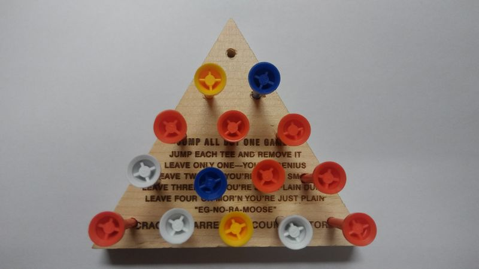
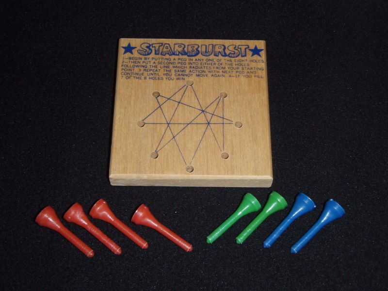

## Introduction

Everyone loves a good puzzle\! (Well, at least everyone who likes to
program computers.) We made a program for a nifty little puzzle in lab
6, and now I think we should expand it a bit\!

We will add to the mix two puzzles which are also peg puzzles. We will
add the cracker barrel triangle solitaire game and the starburst peg
puzzle.

Descriptions of the puzzles follow.

## Cracker Barrel - Triangle Solitaire

In this puzzle, the objective is to remove all but one peg by jumping
over pegs. Jumps can be either along diagonals or within a row. You can
only jump one peg at a time. The printed instructions on the puzzle
board are:

`      "JUMP ALL BUT ONE GAMES"`  
`     JUMP EACH TEE AND REMOVE IT`  
`    LEAVE ONLY ONE -- YOU'RE GENIUS`  
`   LEAVE TWO AND YOU'RE PURTY  SMART`  
` LEAVE  FOUR  OR  MOR'N  YOU'RE JUST PLAIN`  
`            "EG-NO-RA-MOOSE"`  
`    CRACKER BARREL OLD COUNTRY STORE`

## Starburst

The staruburst puzzle goes in the other direction. The objective is to
fill each of the holes except for the last one. The way this is done is
by placing pegs in empty holes by placing a peg into a whole adjacent to
the last peg that you have placed. The printed instructions on the
puzzle board are:

` 1--BEGIN BY PUTTING A PEG IN ANY ONE OF THE EIGHT HOLES`  
` 2--THEN PUT A SECOND PEG INTO EITHER OF THE HOLES `  
` FOLLOWING THE LINE WHICH RADIATES FROM YOUR STARTING `  
` POINT. 3--REPEAT THE SAME ACTION WITH NEXT PEG AND`  
` CONTINUE UNTIL YOU CANNOT MOVE AGAIN. 4--IF, YOU FILL`  
` 7 OF THE 8 HOLES YOU WIN`

## Your Program

Your program should do the following. When the program starts, it
should greet the user with a window with three buttons which allows
them to select which puzzle they wish to play. 

When a puzzle is selected, you should pop up a window with
instructions for how the puzzle is played. The user will then press
any key to continue past the instructions. The user interface for the
puzzle will then be displayed, and the user can try their hand at
playing the puzzle.

Of course, we also want to implement that handy solve function\! Use
backtracking to solve the puzzle from any position when the user
presses the solve button. You can use lab 5 as a guide for this. In
fact, most of the code from lab 5 will be copied over to act as
a starting point for this program.

Clearly, there is some wonderful widget play going on here. You will
need to design your widgets carefully, and make sure you understand how
they work together. I am not requiring you to do any design
documentation, as in you don't have to turn in any diagrams, but I would
think this program would be insanely difficult without a lot of
forethought. It's really not too bad if you think and plan ahead. Some
day, some student may heed my advice. Maybe that student is you\!

On the subject of advice, you need to work on this thing a little each
day. Don't leave it to the end. This program is easy in small chunks but
is absolutely overwhelming if you try to do it all at once.

As always, enjoy the coding experience\!
